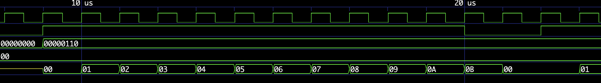
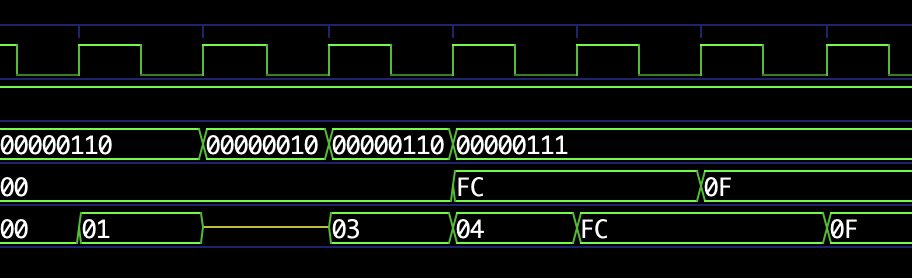
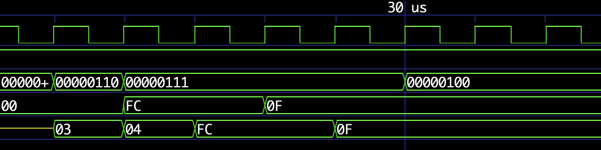
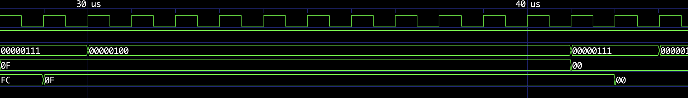
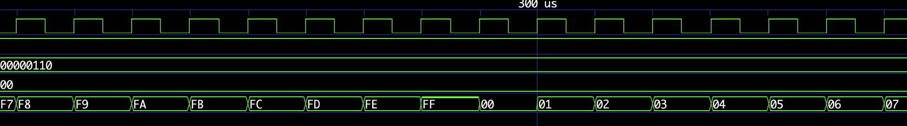

<!---

This file is used to generate your project datasheet. Please fill in the information below and delete any unused
sections.

You can also include images in this folder and reference them in the markdown. Each image must be less than
512 kb in size, and the combined size of all images must be less than 1 MB.
-->

## How it works

This project implements an 8-bit programmable counter. It has a tri-state output where uo[7:0] either represents the value stored in the counter or it can be a high Z output. An arbitrary value can be loaded to the counter using uio[7:0]. The input value ui[2:0] controls the behavior of the counter. The counter can also be reset to 0.

## How to test

| Pins | Usage |
| ---- | ----- |
| ui[0] | load the value from uio[7:0] to counter |
| ui[1] | increment counter value, if 0 the counter will stop incrementing its value |
| ui[2] | enable output, 0 will produce high Z |
| uio[7:0] | value to load to counter |
| uo[7:0] | value stored in counter |

## Test Results

Reset using rst_n

Tri-state output

Load value 11111100

Disable increment

Counting up and over 0xFF

